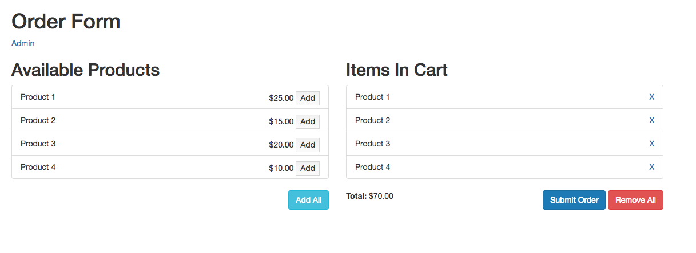
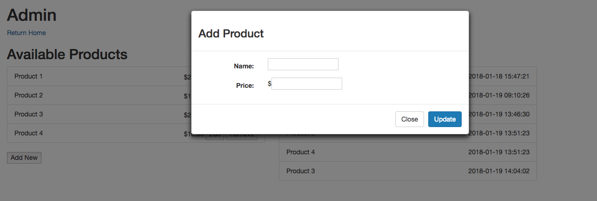
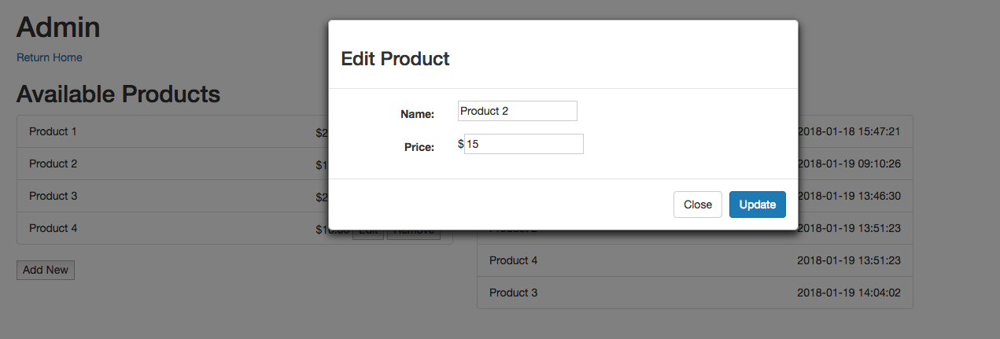

# Exercise 2: Adding and API

The goal of this exercise is to extend the order form created in exercise 1 using a provided API (see API.md).

Additional packages have been added for use, so prior to starting please run the following commands:

1. `composer update`
2. `npm install`
3. `gulp` or `gulp watch`

## Table of Contents

* [Viewing the Code](#viewingthecode)
* [Functionality](#functionality)
    - [Final Product Images](#finalproducts)
- [The Task](#task)
    - [Instructions](#instructions)
    - [Test Cases](#testcases)
- [Important Notes](#important)
    - [AngularJS](#angularjs)
    - [Laravel](#laravel)

<a name="viewingthecode"></a>
## Viewing the Code

1. Run the installation steps shown above
2. Start a local server instance from the Exercise2 directory
`php artisan serve`
3. Open a browser window and go to your localhost, port 8000 (127.0.0.1:8000)

<a name="functionality"></a>
## Functionality

This exercise will add the following functionalities:

* Gather products via an API
* Submit an order
* Admin page
    - Add new products
    - Edit existing products
    - Remove existing products
    - Display all submitted orders

<a name="finalproducts"></a>
### Final Products
The final products should appear as follows:

<a name="order"></a>
#### Order Form


The two changes here are a link to the Admin page and a "Submit Order" button.

<a name="admin"></a>
#### Admin Page


The "Current Orders" section should reflect any submitted orders. There will be no orders by default, so this section should display a "Nothing to show" message at first.

<a name="new"></a>
#### Add New Product


The option to add a new product should appear in a modal.

<a name="edit"></a>
#### Edit Product


The option to edit a product should appear in a modal.

<a name="task"></a>
## The Task

Your task is to create the functionality described above. You should build upon existing files created/edited in exercise 1 as well as create new files as necessary.

All AngularJS files should live at `public/js/app` and all template files should be at `resources/views`. The only files that should be *changed* are
* AngularJS Files
    - `main.js`
    - `app.state.js`
    - `order.controller.js`
* Template Files
    - `admin-angular.blade.php`
    - `home-angular.blade.php`
    - `product_modal.blade.php`

`product_modal.blade.php` can either be used directly or as an example skeleton.

All necessary dependencies, including UI-Router, have already been imported into the HTML, and the module has already been initialized (see resources/views/layouts/application_master.blade.php and resources/views/content.blade.php).

Bootstrap 3 CSS is also included.

The modal should be created using [UI Bootstrap](https://angular-ui.github.io/bootstrap/), which has already been imported into the HTML. TemplateURL values can be generated using `view/{template}`.

<a name="instructions"></a>
### Instructions

To complete this task, the following must be done<sup>[1](#fn1)</sup>:

* Extend the Home template (refer to [Order Form image](#order))
    - Include a link to the Admin page
    - Add a functioning "Submit Order" button
        - Submitted orders should appear under "Current Orders" on the Admin page
        - After submitting an order
            - A message should appear indicating success or failure
            - If successful, the cart should clear
    - Change the table to use the API
- Create Admin Page
    - Create an `admin` state with these attributes
        - url: `/admin/angular`
        - templateUrl: `view/admin-angular`
    - Update the HTML template in `angular-admin.blade.php` (refer to [Admin Page image](#admin))

The final product should match the sample images and all test cases should be true.

<a name="testcases"></a>
### Test Cases

**Order Form**

* The order form products are populated using the API<sup>[2](#fn2)</sup>
* All basic functionality from Exercise 1 still exists
* When a user presses "Submit Order"
    - An success message appears on the Order Form page
    - The cart resets
* When a user presses the "Admin" link, they are moved to the admin page

**Admin Page**

* All available products appear
* Available products are populated using the API<sup>[2](#fn2)</sup>
* All current orders appear<sup>[3](#fn3)</sup>
* When a user presses "Add New" a modal appears (see [Add New image](#new))
* When a user presses close on the "Add New" modal, the "Available Products" reset to their original state and the modal closes
* When a user presses update on the "Add New" modal, the new product appears under "Available Products" on both the Admin Page and the Order Form and the modal closes
* Submission of a new product uses the API
* If any of the following is true upon submission of a new product, an error message appears, the modal data clears, the modal remains open, and no changes exist in the "Available Products" list
    - The name field is blank
    - The name field matches an existing product
    - The price field is blank
    - The price field is not an integer
    - The price field is less than 1
- When a user presses "Edit" for a product, a modal appears (see [Edit Product image](#edit))
* When a user presses close on the "Edit" modal, the "Available Products" reset to their original state and the modal closes
* When a user presses update on the "Edit" modal, the product appears under "Available Products" on both the Admin Page and the Order Form with the updated information and the modal closes
* Updating a product uses the API
* If any of the following is true upon update of a product, an error message appears, the modal data resets, the modal remains open, and no changes exist in the "Available Products" list
    - The name field is blank
    - The name field matches an existing product
    - The price field is blank
    - The price field is not an integer
    - The price field is less than 1
- When a user presses "Remove" for a product, the product no longer appears under "Available Products" on either the Admin Page or the Order Form
- When a user submits an order from the Order Form, the new order(s) appear under "Current Orders"
- When a user presses the "Home" link, they are moved to the Order Form page

<a name="important"></a>
## Important Notes

<a name="angularjs"></a>
### AngularJS

* All AngularJS code should use the [John Papa style guide](https://github.com/johnpapa/angular-styleguide/blob/master/a1/README.md)
* If creating new files:
    - Put them in `public/js/app`
    - Controllers should use ".controller.js". These will compile automatically with `gulp` or `gulp watch`.
    - Any other files will needs to be added to `gulpfile.js`. For example, if creating a `app.config.js` file, update to:
    ```javascript
    mix.scripts([
        '../../../public/js/app/main.js',
        '../../../public/js/app/app.state.js',
        '../../../public/js/app/*.controller.js',
        '../../../public/js/app/app.config.js'
    ], 'public/dist/js/main.js');
    ```
    Run `gulp` or restart `gulp watch` after updating
* Any time a change is made to one of the AngularJS files, you will need to run `gulp` to view the change. This can be prevented by running `gulp watch` prior to starting.

<a name="laravel"></a>
### Laravel

Since this exercise does **not** require Laravel knowledge, the following should be kept in mind:

* Templates, while Blade PHP files, should be normal HTML (see `home-jquery.blade.php`)
* If creating new templates, they should be named using ".blade.php" and should live in `resources/views`
* In order to not conflict with Laravel, start and end symbols have been changed. Use `<%` and `%>` instead of `{{` and `}}` (see [$interpolateProvider documentation](https://docs.angularjs.org/api/ng/provider/$interpolateProvider))

  For example, use `<% vm.variableName %>` instead of `{{ vm.variableName }}`

---
## Footnotes

<a name="fn1"></a>
[1] Please keep in mind that these are bare-bones instructions and do not include all steps. They do assume that Exercise 1 is already complete.

<a name="fn2"></a>
[2] Original products should match Exercise 1

<a name="fn3"></a>
[3] No orders will exist by default
